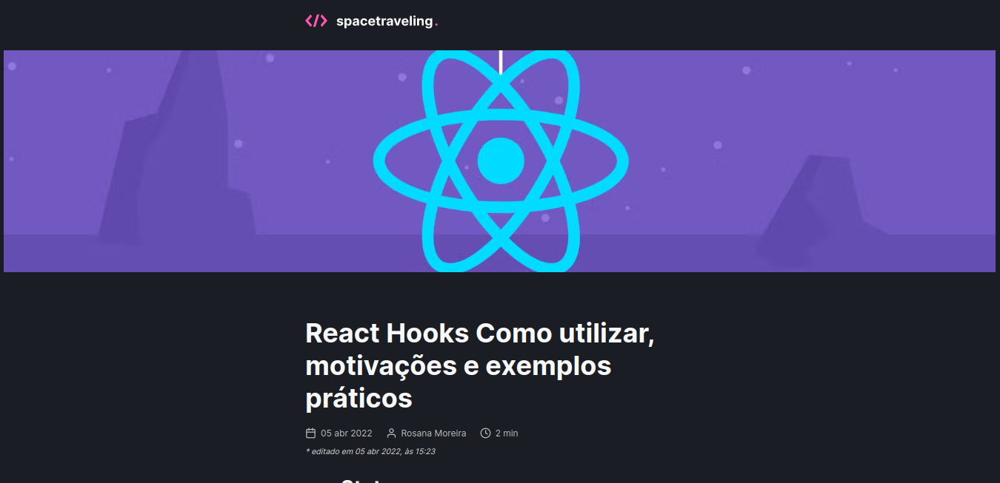

# Spacetraveling

<h2>Descrição do Projeto</h2>
<p align="center">
Aplicação desenvolvida no segundo desafio Ignite React da Rocketseat Capítulo III - Desafio 01 -  Criando um projeto do zero com nextjs.
</p>

<h1 align="center">
  
</h1>
<h2>Pré-requisitos</h2>

Antes de começar, você vai precisar ter instalado em sua máquina as seguintes ferramentas:
[Git](https://git-scm.com) e [React](https://pt-br.reactjs.org/).
Além disto é bom ter um editor para trabalhar com o código como [VSCode](https://code.visualstudio.com/).

# 🎲 Rodando o Front-End

```bash
# Clone este repositório
$ git clone git@github.com:rosana-moreira/Spacetraveling.git

# Acesse a pasta do projeto no terminal/cmd
 cd Spacetraveling

# Instale as dependências
$ yarn

# Execute a aplicação em modo de desenvolvimento
$ yarn dev

# O servidor do back-end inciará na porta:3000 - acesse <http://localhost:3000>

```
